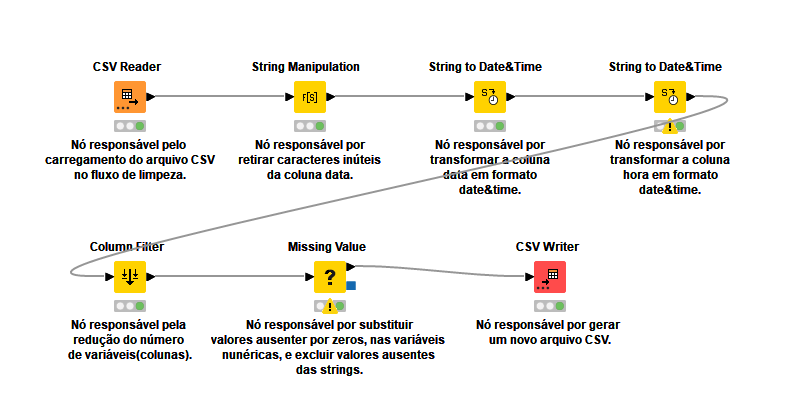

# 🧹 Projeto de Limpeza de Dados com KNIME

## 📌 Visão Geral
Este repositório contém um projeto de **limpeza e preparação de dados** desenvolvido na plataforma **KNIME Analytics Platform**.  
O fluxo automatiza etapas comuns de pré-processamento de dados, permitindo gerar uma base consistente para análises e modelos de Machine Learning.

---

## ⚙️ Funcionalidades do Fluxo
O workflow implementa as seguintes etapas:
1. **Carregamento do CSV original**  
   - Leitura do arquivo `dados_brutos.csv`.
2. **Limpeza de substrings desnecessárias**  
   - Padronização e remoção de caracteres ou termos redundantes.
3. **Transformação de colunas de Data e Hora**  
   - Conversão de `string` para o tipo **Date&Time** das colunas Data e Hora.
4. **Redução de Dimensionalidade**  
   - Aplicação de redução de variáveis para manter apenas as mais relevantes.
5. **Tratamento de valores ausentes**  
   - Substituição de valores nulos em colunas numéricas.  
   - Exclusão de registros com ausência de valores.
6. **Exportação do CSV limpo**  
   - Geração do arquivo `dados_limpos.csv` pronto para análise.

---

## 📂 Estrutura do Repositório

├── projeto_knime/<br>
│ └── fluxo.knwf # Arquivo do workflow do KNIME<br>
├── dataset_original/<br>
│ └── dados_brutos.csv # CSV com dados brutos<br>
├── dataset_limpo/<br>
│ └── dados_limpos.csv # CSV gerado após o processamento<br>
├── imagem/<br>
│ └── diagrama_fluxo.png # (Opcional) Diagrama ilustrativo do fluxo<br>
├── README.md # Este arquivo<br>
└── LICENSE # Licença do projeto (ex: MIT)<br>

---

## Imagem do fluxo de limpeza


---

## ▶️ Como Executar

- Clone o repositório:
   ```
    git clone https://github.com/jcarlossc/limpeza-dados-knime.git
   ```
- Abra o KNIME Analytics Platform. ```https://www.knime.com/```
- Importe o arquivo fluxo.knwf.
- Configure o caminho do dataset dados_brutos.csv.
- Execute o fluxo completo.
- O arquivo limpo será gerado em dataset_limpo/dados_limpos.csv.

---

🛠️ Tecnologias Utilizadas

- KNIME Analytics Platform
- CSV para entrada e saída
- Módulos nativos do KNIME:
  * CSV Reader / Writer
  * String Manipulation
  * String to Date&Time
  * Column Filter
  * Missing Value

---

📜 Licença

Este projeto está sob a licença MIT. Consulte o arquivo LICENSE para mais informações.

---

## 🌐 Portfólio Online

🎯 [portfolio-carlos-costa.netlify.app](https://portfolio-carlos-costa.netlify.app/)

---

## 📫 Contato

- Recife, PE - Brasil  
- Telefone: +55 81 99712 9140<br>
- Telegram: @jcarlossc
- 📧 Email: [jcarlossc1977@gmail.com](mailto:jcarlossc1977@gmail.com)  
- 💼 LinkedIn: [linkedin.com/in/carlos-da-costa-669252149/](https://www.linkedin.com/in/carlos-da-costa-669252149/)  
- 🐙 GitHub: [github.com/jcarlossc](https://github.com/jcarlossc)  
- 📊 Kaggle: [kaggle.com/jcarlossc](https://www.kaggle.com/jcarlossc/code)
